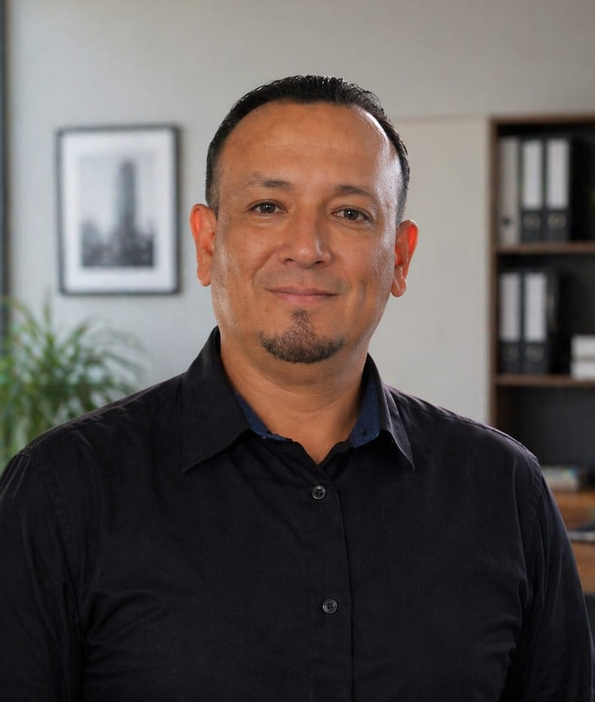

  

<h1 align="center">
Lenin Fernando Jiménez Herrera
</h1>

<strong>Blue Team • SOC Operations • Threat Hunting • Detection Engineering • Incident Response</strong>

---

# Sobre mí

Soy un profesional de Tecnologías de la Información con experiencia en infraestructura tecnológica, administración de sistemas y soporte, actualmente orientando mi desarrollo profesional hacia la **ciberseguridad defensiva**.

Este portafolio representa mi proceso de aprendizaje continuo mediante un laboratorio propio, donde documento de forma transparente la implementación de tecnologías, investigaciones, reglas de detección y casos prácticos basados en evidencia.

Mi objetivo es fortalecer competencias técnicas en **SOC Operations**, **Threat Hunting**, **Detection Engineering** e **Incident Response**, aplicando metodologías y buenas prácticas utilizadas por equipos **Blue Team**.

---

# Propósito de este Portafolio

Este repositorio fue creado para documentar de manera estructurada el desarrollo de un laboratorio profesional de ciberseguridad defensiva.

Cada laboratorio, investigación y proyecto tiene como finalidad:

- Documentar implementaciones realizadas en el laboratorio.
- Registrar investigaciones técnicas basadas en evidencia.
- Validar reglas de detección y mecanismos de monitoreo.
- Desarrollar investigaciones de Threat Hunting.
- Fortalecer capacidades de análisis e Incident Response.
- Mantener documentación técnica clara, reproducible y organizada.

Todo el contenido publicado corresponde a actividades realizadas dentro del entorno de laboratorio y documentadas utilizando una metodología uniforme.

---

# Mi Enfoque Profesional

Mi interés está orientado al trabajo dentro de equipos **SOC** y **Blue Team**, participando en actividades como:

- Security Monitoring
- Alert Triage
- Log Analysis
- Threat Hunting
- Detection Engineering
- Incident Response
- SIEM Administration

Considero que el aprendizaje continuo, la experimentación en laboratorio y la documentación técnica son elementos fundamentales para el crecimiento profesional en ciberseguridad.

---

# Actualmente

Actualmente continúo ampliando este laboratorio mediante:

- Nuevos escenarios de Threat Hunting.
- Desarrollo y validación de reglas de detección.
- Casos prácticos de Incident Response.
- Investigaciones sobre Windows y Linux.
- Documentación técnica de proyectos.
- Nuevos laboratorios orientados a Blue Team.

---

# Principios de Trabajo

La documentación de este portafolio se basa en los siguientes principios:

- Evidencia antes que suposiciones.
- Aprendizaje continuo.
- Documentación técnica clara y reproducible.
- Mejora continua del laboratorio.
- Aplicación de metodologías utilizadas en la industria.
- Desarrollo práctico basado en escenarios reales de laboratorio.

---

# Objetivo Profesional

Continuar desarrollándome profesionalmente como **SOC Analyst**, **SIEM Analyst** o integrante de un equipo **Blue Team**, contribuyendo al monitoreo, detección, investigación y respuesta ante incidentes mediante el aprendizaje continuo y la aplicación de buenas prácticas de ciberseguridad defensiva.

---

# Más información

Para conocer mi experiencia profesional, formación, certificaciones y trayectoria, visita:

- **GitHub Profile:** https://github.com/fernando-jimenezh
- **LinkedIn:** https://www.linkedin.com/in/lenin-fernando-jim%C3%A9nez-7750aa2b0

---

> *"El aprendizaje continuo, la práctica constante y la documentación técnica basada en evidencia son pilares fundamentales para fortalecer las capacidades defensivas en ciberseguridad."*